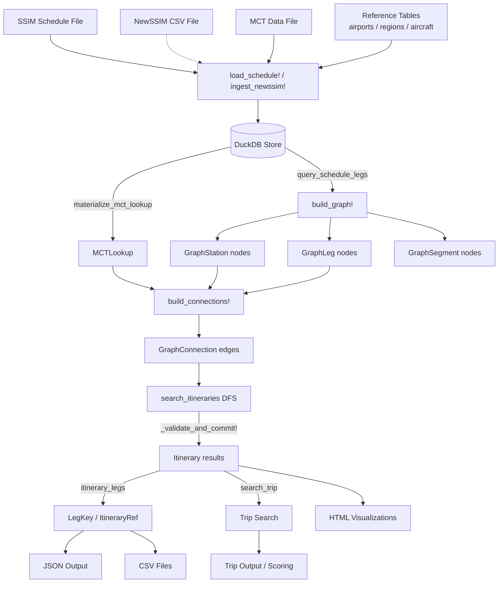
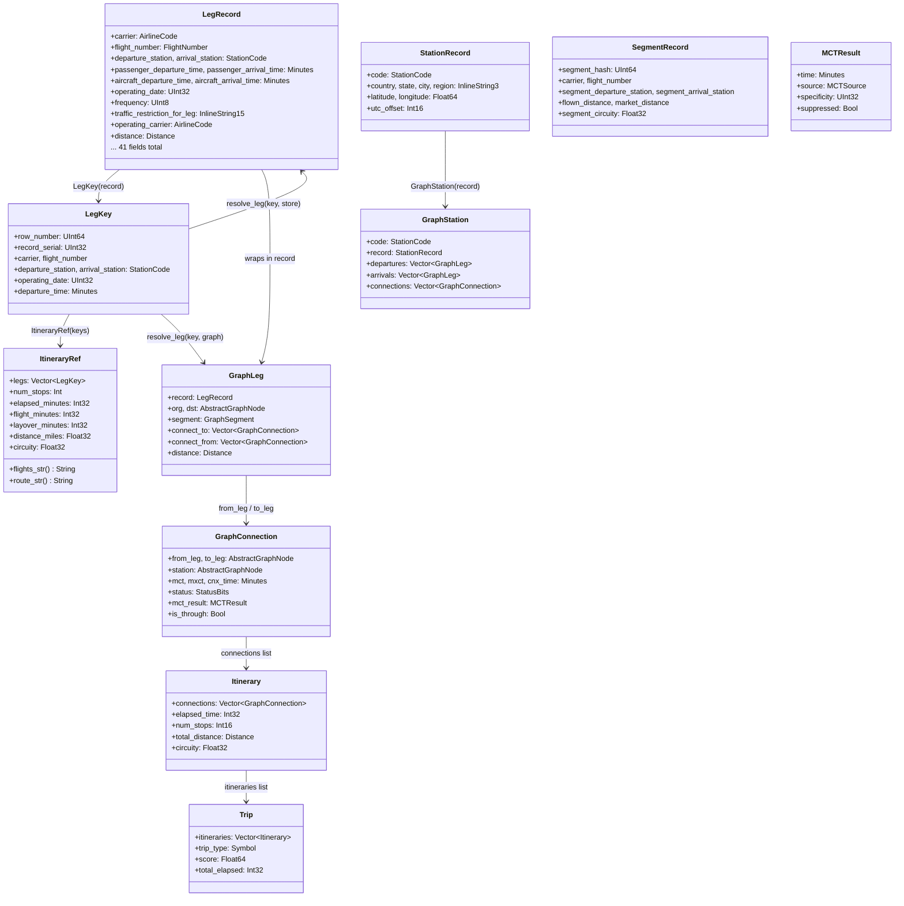

# Architecture

> **See also:** [`docs/diagrams/`](https://github.com/cell-scape/ItinerarySearch.jl/tree/main/docs/diagrams)
> contains a set of editable drawio diagrams covering the module layout, ingest
> pipelines, search workflow, entry points (CLI + REST), and data-model layers.
> Open them in VS Code (Draw.io Integration extension) or at
> [app.diagrams.net](https://app.diagrams.net).

## Data Pipeline

The system transforms raw airline schedule files into searchable itineraries through a five-stage pipeline:



### Stage 1: Ingest

`load_schedule!(store, config)` orchestrates three ingest steps:

1. `ingest_ssim!` — streams the SSIM fixed-width file, expands EDF date ranges into per-day operating records, resolves DEI 50 codeshare supplements, and writes rows to the DuckDB `legs` table
2. `ingest_mct!` — parses MCT records into the `mct` table
3. `load_airports!`, `load_regions!`, `load_aircrafts!`, `load_oa_control!` — populate reference tables

A SQL post-ingest pipeline runs inside DuckDB to join codeshare data, build the `segments` table, and inject market distances from the `markets` table.

**Alternative: NewSSIM CSV path.** `ingest_newssim!(store, path; delimiter=nothing)` loads a denormalized CSV file (comma, pipe, or tab-delimited; .gz supported) into the DuckDB `newssim` table. This bypasses SSIM parsing and reference table loading. MCT ingest still runs separately. Pass `source=:newssim` to `build_graph!` to query the `newssim` table instead of the SSIM pipeline tables.

### Stage 2: Graph Materialization

`build_graph!(store, config, target_date)` queries DuckDB for the schedule window (`target_date - leading_days` to `target_date + trailing_days`), then:

1. Creates one `GraphStation` node per unique IATA code, populated from the `stations` reference table when available
2. Creates one `GraphLeg` node per schedule row and links each leg to its origin and destination station nodes
3. Gap-fills missing leg distances using the configured geodesic formula (haversine or Vincenty)
4. Groups legs into `GraphSegment` nodes by segment hash; resolves codeshare / operating carrier per segment
5. Materializes the `MCTLookup` in memory from the DuckDB `mct` table, keyed by `(arr_station, dep_station)` pairs for inter-station MCT support

### Stage 3: Connection Building

`build_connections!` makes an O(n²) pass over departing and arriving legs at each station. For every arriving-leg / departing-leg pair at a station, it runs the connection rule chain:

- `MCTRule` — minimum connecting time from the SSIM8 cascade (passes full context: codeshare status, operating carrier, equipment, flight number, geography, target date)
- `MAFTRule` — maximum aircraft flow time (connection window upper bound)
- `CircuityRule` — per-leg circuity ratio
- `check_cnx_scope` — domestic / international scope filter
- `check_cnx_interline` — carrier interline mode filter
- `check_cnx_opdays` — operating day intersection
- `check_cnx_roundtrip` — roundtrip detection
- `check_cnx_backtrack` — backtrack detection (arriving and departing to the same station)
- `check_cnx_suppcodes` / `check_cnx_trfrest` — suppression codes and traffic restriction codes

Rules return positive on pass, zero or negative on fail. A passing pair produces a `GraphConnection` edge added to both legs' `connect_to` / `connect_from` lists and the station's `connections` list. Nonstop self-connections are also created for every departing leg (used as the first edge in the DFS).

**MCT Cache:** An `MCTCacheKey` (isbits, 96 bytes) indexes MCT results by all SSIM8 fields except flight numbers and target date. On cache hit, the result is revalidated: if the matched record used flight-number ranges or date validity, the hit is discarded and a full cascade lookup runs. This yields ~77% hit rate while guaranteeing correctness. Configurable via `mct_cache_enabled` (default `true`).

**Tier 1 Instrumentation:** Every rule evaluation is tracked via per-rule pass/fail counters on `BuildStats`. MCT lookups are instrumented with cascade source counters (exception, standard, default, suppression), a 48-bucket time histogram, and a running average. When `metrics_level == :full`, each MCT decision produces a zero-allocation `MCTSelectionRow` audit record. After the build pass, `aggregate_geo_stats` produces geographic aggregations (metro, state, country, region) stored on `FlightGraph.geo_stats`.

### Stage 4: DFS Search

`search_itineraries` iterates every departing leg at the origin station that is valid on the target date. For each departure leg it:

1. Retrieves the nonstop self-connection via `dep_leg.nonstop_cp` (direct field access, set during connection build) and pushes it as the first edge of the working `Itinerary`
2. If the departure leg reaches the destination directly, calls `_validate_and_commit!`
3. Otherwise calls `_dfs!` which recursively follows `GraphConnection` edges, applying:
   - Cycle detection (station already visited in the current path)
   - Date / DOW validity check on each connection
   - Elapsed-time pruning (1.5 × `max_elapsed` threshold)
   - Cumulative circuity pruning
   - Direction pruning (bearing divergence from destination)

When a complete path reaches the destination, `_validate_and_commit!` runs the itinerary rule chain, computes elapsed time via UTC conversion, counts geographic diversity, and deep-copies the result into `ctx.results`.

**Tier 1 Instrumentation:** Each search tracks query count, max DFS depth reached, paths found/rejected with stop-count distribution, elapsed-time histogram (30-min buckets, 0–1440 min), distance histogram (250-mile buckets, 0–10000 mi), and wall-clock search time in nanoseconds — all accumulated on `SearchStats`.

### Stage 5: Output

The `itinerary_legs` / `itinerary_legs_multi` / `itinerary_legs_json` functions post-process `Vector{Itinerary}` results into the compact `ItineraryRef` index format: deduplicated (by leg-sequence fingerprint), sorted by stops → elapsed → distance (nonstops first), and wrapped with summary fields.

CSV output (`write_legs`, `write_itineraries`, `write_trips`) flattens graph objects into comma-delimited rows with canonical column names. Visualizations serialize graph and itinerary data to JSON embedded in self-contained HTML pages.

### Observability

Two parallel observability systems operate independently:

**Structured Logging** (Julia's `@info`/`@debug`/`@warn`/`@error`) — LoggingExtras `TeeLogger` fans out every log call to both a `ConsoleLogger` (human-readable stderr) and a `FormatLogger` (DynaTrace-compatible JSON to file and/or stdout). `setup_logger(config)` builds the TeeLogger at the start of `build_graph!` and restores the original logger in a `finally` block. Log level resolves from `ENV["ITINERARY_SEARCH_LOG_LEVEL"]` → `config.log_level` → `:info`. Verbose `@debug` calls are placed across all phases (ingest, connection build, search) and are zero-cost at INFO level.

**Event Log** (`EventLog` with `emit!`/`checkpoint!`/`with_phase`) — typed event structs (`SystemMetricsEvent`, `PhaseEvent`, `BuildSnapshotEvent`, `SearchSnapshotEvent`, `CustomEvent`) emitted through a pluggable sink interface. A JSONL file sink serializes events via JSON3. Cooperative checkpoints at phase boundaries in `build_graph!` capture system metrics (RSS, GC stats, thread count). Disabled by default (`event_log_enabled = false`).

Both systems are configured via `SearchConfig` and can run simultaneously to different file paths.

### CLI

The `CLI` submodule (`src/cli.jl`) wraps the pipeline in an ArgParse.jl command interface with 6 commands: `search`, `trip`, `build`, `ingest`, `info`, `serve`. Each command follows the same pattern: open store → ingest (if needed) → build graph (if needed) → execute → write JSON to stdout or file → close. Global flags provide per-invocation overrides for SearchConfig and ParameterSet fields. The `--newssim` and `--delimiter` flags enable CSV-based ingest as an alternative to SSIM fixed-width. The `main(args)::Int` entry point returns exit codes and is PackageCompiler-ready.

### Compilation

**PrecompileTools** — A `@compile_workload` block in the module exercises core code paths (type construction, MCT lookup, rule chains, DuckDB store, JSON serialization, CLI parser) during `Pkg.precompile()`, caching native code for ~400ms load / ~100ms first-call.

### REST API

The `Server` submodule (`src/server.jl`) wraps the pipeline in an HTTP.jl service. A `ServerState` mutable struct holds the shared `FlightGraph`, `DuckDBStore`, `SearchConfig`, and synchronization primitives (`ReentrantLock` for graph swap, `Atomic{Bool}` for rebuild guard). The graph is built once at startup and shared read-only across concurrent request threads. Each request handler snapshots the graph reference under the lock (microsecond hold), creates a per-request `RuntimeContext`, executes the search, and returns JSON. `POST /rebuild` triggers a background `build_graph!` that atomically swaps the graph when complete — in-flight requests continue using their pre-swap snapshot. Five endpoints: `/search`, `/trip`, `/station/:code`, `/health`, `/rebuild`. The `/rebuild` endpoint accepts an optional `"source"` field (`"newssim"`) to rebuild from the CSV pipeline.

**PackageCompiler** — `build/build.jl` supports sysimage mode (0ms module load, ~236MB `.so`) and standalone app mode. A dedicated `build/precompile_workload.jl` runs the full pipeline (ingest, graph build, search, JSON output) with synthetic data, capturing all method specializations without requiring test-only dependencies.

---

## Type Hierarchy



The type system splits into two layers:

**Record layer** — Immutable, `isbits` structs used as the DuckDB↔Julia bridge. `LegRecord` is the canonical 41-field schedule record. `LegKey` is a compact cross-reference carrying only identity fields. `ItineraryRef` is a serializable summary with an ordered `Vector{LegKey}` and numeric aggregates (elapsed, flight, layover minutes, distance, circuity) — display strings like `flights_str()` and `route_str()` are derived on demand to minimize allocations. Suitable for cross-system handoff and reaccommodation candidate lists without carrying graph pointers.

**Graph layer** — Mutable, pointer-linked structs forming the in-memory network. `GraphStation`, `GraphLeg`, and `GraphConnection` are linked by direct object references for zero-cost traversal during DFS. `Itinerary` and `Trip` aggregate graph edges into the search result containers.

---

## Key Design Principles

### InlineString type aliases

Domain string types (`StationCode`, `AirlineCode`, `FlightNumber`) are type aliases for `InlineStrings.String7` or similar fixed-width inline types. This keeps them `isbits`, stack-allocated, and usable in `Vector` without boxing. Avoids the pointer-call and hang pitfalls of raw `StaticString` approaches.

```julia
const StationCode = InlineString3   # "ORD", "LHR", etc. (3-char IATA, 4 bytes)
const AirlineCode = InlineString3   # "UA", "LH", etc.
const FlightNumber = Int16          # 774, 3612, etc.
```

### CEnum enums

All enums use `CEnum.@cenum` for C-ABI compatibility and bitmask operations. The `StatusBits` type (`UInt32`) carries both DOW bits (`DOW_MON` through `DOW_SUN`) and classification flags (`STATUS_INTERNATIONAL`, `STATUS_INTERLINE`, `STATUS_CODESHARE`, `STATUS_THROUGH`, `STATUS_WETLEASE`) in a single word. This allows fast intersection and propagation during DFS push/pop.

### DuckDB singleton store

All tabular data — schedules, MCT, airports, regions — flows through a single `DuckDBStore`. Ingest is streaming; queries return `LegRecord` vectors or `SegmentRecord` structs. The SQL post-ingest pipeline handles joins and enrichment inside DuckDB, offloading data transformation from Julia.

### Concrete-typed vectors

Hot-path structs use concrete element types:

- `GraphStation.departures :: Vector{GraphLeg}` (not `Vector{AbstractGraphNode}`)
- `GraphStation.connections :: Vector{GraphConnection}`
- `GraphLeg.connect_to :: Vector{GraphConnection}`

This eliminates dynamic dispatch in the O(n²) connection builder and the DFS inner loop. Cross-reference fields that must span forward declarations (e.g., `GraphConnection.from_leg`) use `AbstractGraphNode` as the declared type but are always cast to the concrete type at use sites.

### Rule chains

Connection rules and itinerary rules are stored as `Tuple`s (not `Vector{Any}`). Each rule takes a connection or itinerary plus the `RuntimeContext` and returns an `Int` (positive = pass, zero or negative = fail with reason code). Using Tuples enables the compiler to fully specialize the rule chain loop — each rule's concrete type is known at compile time, eliminating dynamic dispatch in the O(n²) connection builder. Rules are enabled or disabled by including or excluding them from the chain, making policy changes purely compositional.

### Push/pop DFS pattern

The DFS working `Itinerary` is mutated in place — connections pushed, status bits OR'd, stop count incremented — and all state is restored on backtrack. Deep copies are made only when committing a complete result. This eliminates allocations in the hot path.

### Immutable SearchConfig

`SearchConfig` is an immutable struct. Runtime changes (e.g., from a REST API) construct a new `SearchConfig` and atomically swap a reference — no locking, no mutation of shared state.
